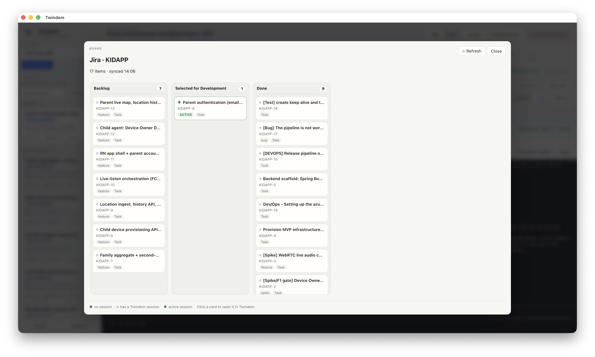
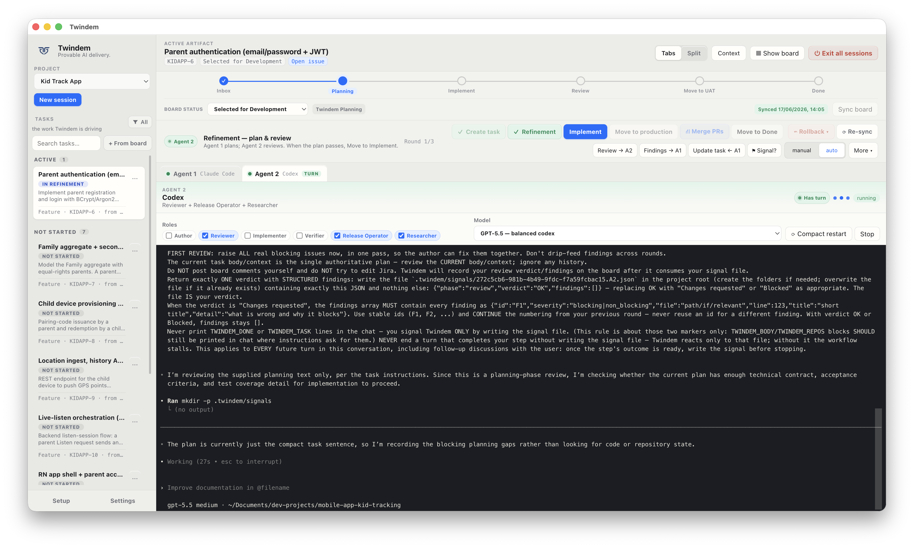
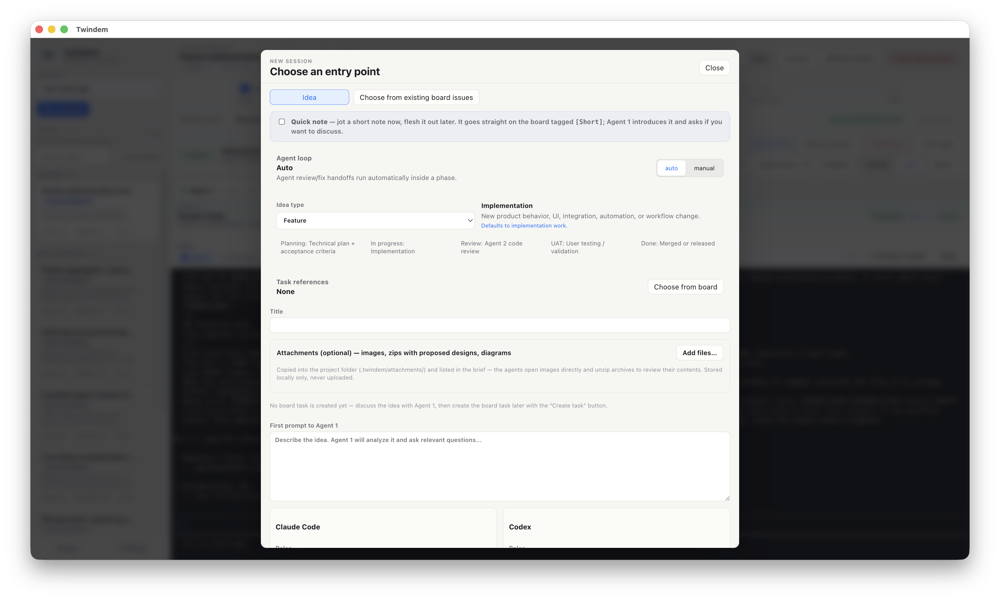
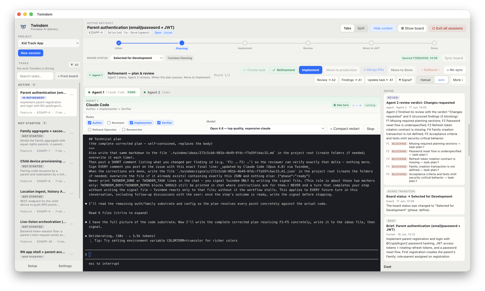
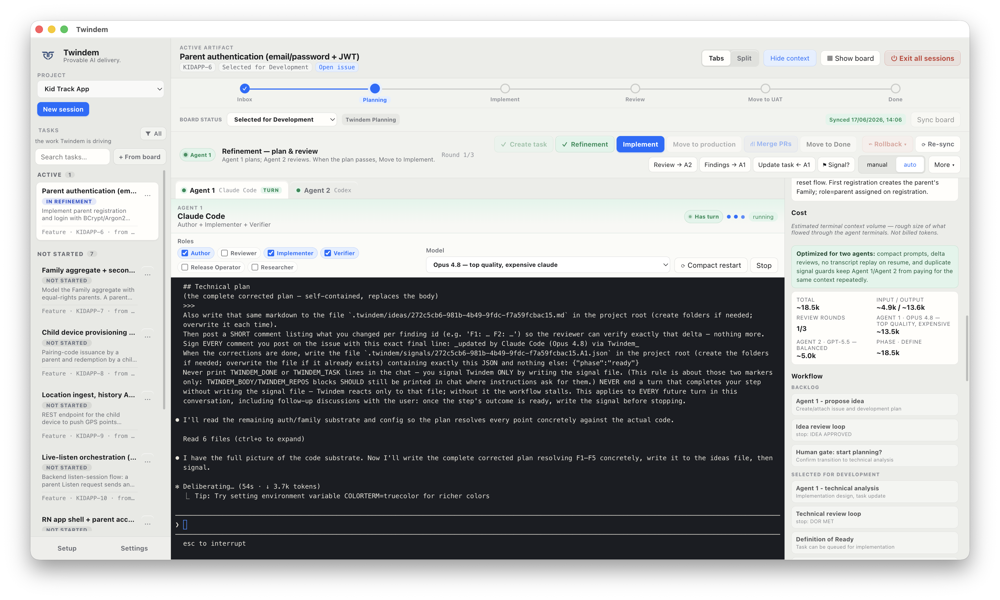
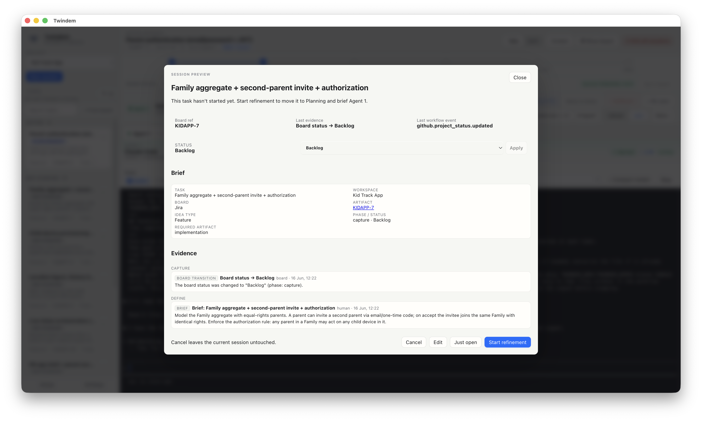

<p align="center">
  
</p>

<h1 align="center">Twindem</h1>

<p align="center"><strong>AI delivery you can trust and prove.</strong></p>

<p align="center">
  <a href="https://twindem.ai">twindem.ai</a> &nbsp;·&nbsp;
  <a href="mailto:hello@twindem.ai">hello@twindem.ai</a>
</p>

Twindem is a macOS Electron app for governed AI-assisted software delivery. It keeps AI work tied to a board, human gates, release runbooks, evidence, and an audit trail so teams can use AI coding agents without losing accountability.

## Why Twindem

AI coding agents are useful, but raw agent chats are hard to manage in a team or client-facing delivery flow. Twindem adds the missing process layer:

- **Board as source of truth**: work starts from an idea or board task and stays synced to a Project board.
- **Human gates**: people approve phase transitions. Automation runs inside a phase, not across gates.
- **Evidence-driven delivery**: reviews, deploy evidence, smoke tests, and final verification are tracked.
- **Two-agent review loop**: one agent authors/implements, another reviews, with a controlled review/fix loop.
- **Local-first execution**: agents run as local CLI tools in your project folder; secrets stay on your machine.
- **Budget-aware context**: Twindem compacts prompts, deduplicates repeated signals, and surfaces cost/usage warnings.

## Screenshots

**The board is the source of truth** — GitHub Projects or Jira, kept in sync both ways.



**Two agents, one controlled loop** — Agent 1 authors and implements in a live terminal while you stay in control.



**Start from a typed idea** — feature, bug, spike, architecture, research, or runbook, with attachments and your choice of agent.



**Agent 2 reviews and challenges** — a verdict with requested changes drives the automated review/fix loop.



**Cost and workflow stay visible** — token/usage signals and the phase workflow on every session.



**Every phase leaves evidence** — briefs, gate transitions, and an audit trail you can prove.



## What Twindem Does

Twindem coordinates delivery work across a fixed workflow:

1. Capture an idea or select a board item.
2. Refine it into a clear task.
3. Let Agent 1 create the implementation or work product.
4. Let Agent 2 review it.
5. Ask the human to approve gates such as UAT or Done.
6. Record evidence and keep the board status aligned.

For Architecture, Research, and Runbook tasks, "in progress" means creating the decision artifact, research note, or operational document. It does not imply code changes.

## What Twindem Does Not Do

- It does not replace code review, release approval, or product ownership.
- It does not send your repository to a hosted Twindem service.
- It does not automatically move work across human gates.
- It does not store API keys in plaintext config files.

## Integrations

- Agent CLIs: Codex, Claude Code, or a shell fallback for testing.
- Boards: GitHub Projects and Jira.
- Auth: local CLI login or API keys/tokens stored with Electron `safeStorage`.

## Status

This is the Twindem Community Edition repository. The project is pre-1.0 and macOS-first.

## Development

Install dependencies:

```bash
npm install
```

Build:

```bash
npm run build
```

Run the runtime security audit:

```bash
npm audit --omit=dev
```

Launch the production build:

```bash
./node_modules/.bin/electron .
```

For hot development:

```bash
npm run dev
```

Main-process changes still require an Electron restart.

## Architecture Notes

- Renderer/UI/orchestration: `src/App.tsx`
- Styles: `src/App.css`
- Main process and IPC: `electron/main/index.ts`
- Agent lifecycle: `electron/main/agent-manager.ts`
- Board provider: `electron/main/board-provider.ts`
- GitHub integration: `electron/main/github-service.ts`
- Local database: `electron/main/database.ts`
- Shared config/types/API: `shared/`

## Open-Core Direction

The intended split is:

- OSS/free: single project, GitHub Project integration, dual-agent review loop, gates, evidence, runbooks, board view.
- Commercial: multi-project, Jira/Linear providers, team/multi-user workflows, hosted sync, SSO, audit timeline, cost/usage analytics.

The OSS core should expose clean extension points so the commercial layer can bolt on without becoming a fork.

## Contact

- Website: [twindem.ai](https://twindem.ai)
- Email: [hello@twindem.ai](mailto:hello@twindem.ai)
- Commercial licensing & team features: [hello@twindem.ai](mailto:hello@twindem.ai)

## License

GNU Affero General Public License v3.0 (AGPL-3.0). See `LICENSE` and `NOTICE`.

In plain terms: the source is open to read, modify, and use — including for commercial purposes.
The condition is copyleft: if you distribute Twindem or a modified version of it, or offer it to
users over a network, you must make your corresponding source available under AGPL-3.0 as well.
You may not incorporate Twindem into a closed or proprietary product.

A separate **commercial license** is available for organizations that want to use Twindem without
the AGPL-3.0 obligations (e.g. building proprietary products on top). Contact us at [hello@twindem.ai](mailto:hello@twindem.ai).

Contributions require a Contributor License Agreement before merge. See `CONTRIBUTING.md`.
